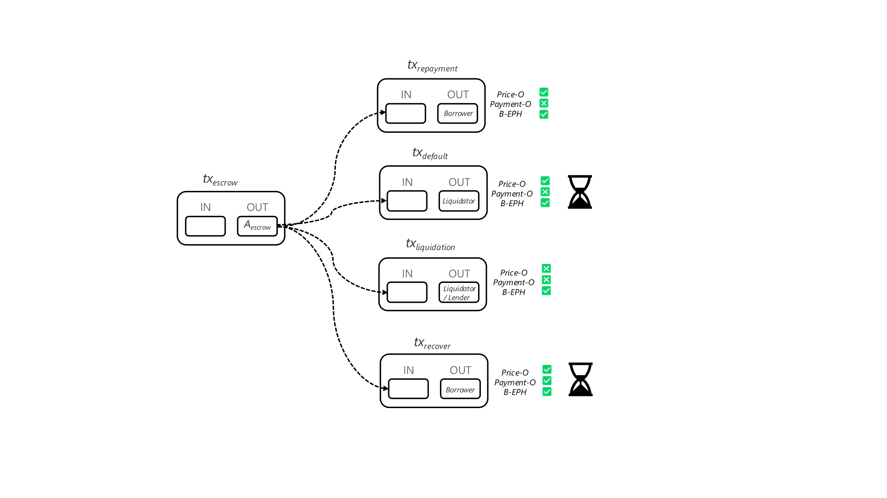
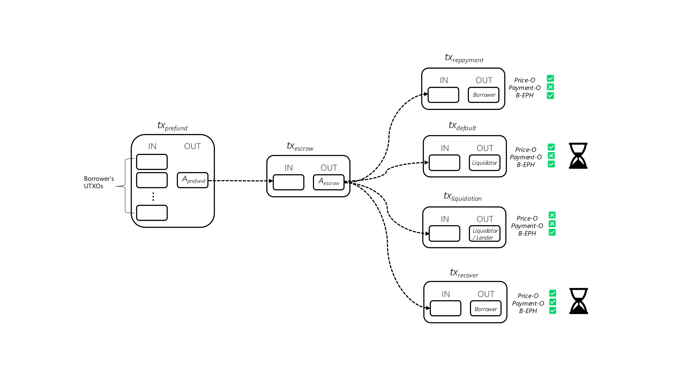

# Firefish Protocol

> This document outlines the technical design of the Firefish Protocol. Please note that the actual implementation—delivered through the Firefish application—may differ in certain aspects, as both the application and the underlying escrow system remain under active development. For the most accurate and up-to-date information on the current functionality and limitations of the Firefish Protocol, please refer to the [Terms of Service](/docs/legal/terms-of-service).

## Participants in Firefish Protocol
- **Borrower:** An individual or entity that owns bitcoin and seeks fiat or stablecoins liquidity.
- **Lender:** An individual or entity that has excess fiat or stablecoins liquidity and wants to earn interest.
- **Liquidator:** An entity entrusted by the Lender to liquidate the collateral in its name in the event that the Borrower does not fulfill its obligations. The Lender can also act as the Liquidator themselves.
- **Price Oracle:** An Oracle that attests to the price of bitcoin. It can be implemented as a trusted institution, a public oracle, or a threshold of institutions and public oracles. Price Oracle is currently operated by Firefish.
- **Payment Oracle:** An Oracle that attests to whether or not a funds transfer has been made (e.g. loan repayment). Payment Oracle is currently operated by Firefish.
- **Firefish:** A platform that matches Borrowers and Lenders and facilitates their secure interaction.

## Loan outcomes
- **Repayment**
  - **Description:** Loan successfully repaid
  - **Result:** All bitcoin collateral is returned to the Borrower
  - **Trigger:** Payment-oracle
- **Default**
  - **Description:** Loan not successfully repaid
  - **Result:** Bitcoin collateral is sent to the Liquidator (distribution escrow). Part of the collateral is used to cover the amount due (either in Bitcoin for self-liquidation or in loan currency for Firefish liquidation), the rest is returned back to Borrower
  - **Trigger:** Price-oracle
- **Liquidation** 
  - **Description:** Borrower’s collateral does not fully secure the loan anymore due to the decrease in its value
  - **Result:** All bitcoin collateral is sent to Lender (for self-liquidation) or Liquidator (for Firefish liquidation)
  - **Trigger:** Price-oracle and Payment-oracle
- **Cancellation**
  - **Description:** Borrower locked bitcoin into escrow but Lender did not provide loan funds to the Borrower
  - **Result:** All bitcoin collateral is returned to the Borrower
  - **Trigger:** Payment-oracle
- **Disaster** 
  - **Description:** Oracles are not responsive
  - **Result:** Borrower can rescue all bitcoin collateral from escrow one month after the maturity date via the recovery transaction
  - **Trigger:** Borrower

 | Loan outcome | Description | Result | Trigger | 
| :--- | :--- | :--- | :--- |
| Repayment | Loan successfully repaid | All bitcoin collateral is returned to the Borrower | Payment‑oracle |
| Default | Loan not successfully repaid | Bitcoin collateral is sent to the Liquidator (distribution escrow). Part of the collateral is used to cover the amount due (either in Bitcoin for self-liquidation or in loan currency for Firefish liquidation), the rest is returned back to Borrower | Price‑oracle | 
| Liquidation | Borrower’s collateral does not fully secure the loan anymore due to the decrease in its value | All bitcoin collateral is sent to Lender (for self-liquidation) or Liquidator (for Firefish liquidation) | Price‑oracle and Payment‑oracle |
| Cancellation | Borrower locked bitcoin into escrow but Lender did not provide loan funds to the Borrower | All bitcoin collateral is returned to the Borrower | Payment‑oracle |
| Disaster | Oracles are not responsive | Borrower can rescue all bitcoin collateral from escrow one month after the maturity date via the recovery transaction | Borrower |

## Escrow Contract

The escrow contract is a central part of the Firefish Protocol. It allows to lock bitcoin collateral on a specific multis-signature address and specifies the rules how this collateral can be spent.

The first layer of the escrow contract is the escrow transaction (txescrow). Its input is the Borrower's bitcoin (via the Prefund transaction defined below) and its output is a 3-of-3 multisig, with keys held by:
- The Price Oracle
- The Payment Oracle
- The Borrower (Borrower's escrow key)

The output of the escrow transaction represents the escrow itself, and this is where the bitcoin is held during the loan.

The second layer of the escrow contract is represented by a set of partially signed transactions (called closing transactions) spending bitcoin collateral from the escrow output either to Lender/Liquidator or Borrower, corresponding to possible outcomes of the loan. All these transactions are presigned by the Borrower (Borrower's escrow key), whose private key is then discarded. Discarding Borrower’s private key ensures that these pre-signed transactions become the only way to move the bitcoin collateral from the escrow, effectively locking all parties into the agreed-upon rules.

### Timelocks
Some closing transactions use timelocks, ensuring that these transactions can only be used from a specific date in the future. Concretely
- the closing transaction corresponding to Default has a timelock set to the maturity date, as a potential Default is evaluated not earlier than at the maturity date, and
- the closing transaction corresponding to Disaster has a timelock set to one month after the maturity date, as an escrow is already spent at this time when oracles are responsive.

### Summary of closing transactions 
There are at total five closing transactions:

| Loan outcome | Closing transaction | Missing signature | Output to | Timelock | 
| :--- | :---: | :---: | :---: | :---: |
| Repayment | txrepayment | Payment Oracle | Borrower| - |
| Default | txdefault | Payment Oracle | Liquidator | maturity date |
| Liquidation | txliquidation | Price Oracle, Payment Oracle | Lender/Liquidator | - |
| Cancellation | txrepayment | Payment Oracle | Borrower| - |
| Disaster | txrecover | - | Borrower| maturity date + 1 month |

The escrow contract can be schematically depicted as follows:

## Prefund Contract

To make it practical for Borrowers who use a variety of bitcoin infrastructure (hardware wallets, software wallets, custodial wallets), we propose using an extra on-chain transaction to consolidate and acknowledge the UTXOs that will be used to fund the escrow contract.

This construct makes it easy for Borrowers to interact with the Firefish protocol. First, they send their bitcoin collateral to a specific prefund address (Aprefund), which allows to create the follow-up escrow and closing transactions. 

The prefund address represents the following spending condition:

- 3-of-3 multisig (Borrower’s prefund key, Price Oracle, Payment Oracle), or
- Borrower’s prefund key and a relative timelock of 7 days

The first spending condition using the multisig is used to move bitcoin from prefund to escrow when all parties cooperate. 
The second spending condition using only Borrower’s prefund key with a relative timelock works as a safeguard for the Borrower, should oracles become unresponsive or malicious during the contract setup.

Once the Bitcoin is locked into prefund, all information is known to create the escrow and closing transactions.

The whole Firefish protocol, including prefund, escrow and closing transactions, can be schematically depicted as follows:

## Protocol Implementation

The whole Firefish protocol is implemented in Rust. To simplify the interaction with the protocol for Borrowers, the Borrower's part, called borrower-client, is compiled into WASM and runs at app.firefish.io. The source code for the borrower-client is available HERE. It also contains instructions for deterministic builds, allowing Borrowers to verify that the client used at [Firefish](https://app.firefish.io) corresponds to the published source code. 

## The Process

Below you can find the simplified process of the escrow setup and the lifetime of the loan. 

1. The participants in the protocol securely exchange necessary data (such as loan details) and public keys.
2. Borrower enters his return address where bitcoin collateral will be returned upon successful repayment
3. Using the borrower-client, the Borrower generates the prefund address
4. The Borrower sends bitcoin collateral to the prefund address using their own wallet.
5. Using the borrower-client, the Borrower constructs the escrow and closing transactions, and adds their own signatures to the closing transactions.
6. The oracles add their own signatures to the escrow transaction and the closing transactions according to the protocol specification.
7. Using the borrower-client, the Borrower verifies that all transactions and signatures are in place. After verification, Borrower adds the last missing signature to the escrow transaction.
8. Using the borrower-client, the Borrower discards their escrow private key, ensuring that the spending options for the escrow are limited to those defined by the closing transactions.
9. Borrower broadcasts the now fully signed escrow transaction, effectively locking bitcoin collateral. The escrow is properly set.
10. Lender sends funds (fiat or stablecoins) to the Borrower.
11. Later, when the loan outcome is known (repayment, default, …), the corresponding transaction is signed and broadcast by the responsible oracle for the given outcome.

## Key Benefits of Firefish Protocol

- The escrow has a "deterministic" nature. It can only be spent on the Borrower's or Lender’s/Liquidator's address, but not to any other subject.
- The Lender does not need to possess any cryptographic material or otherwise interact with the Bitcoin network. This allows entities that are not Bitcoin-native to invest on the Firefish platform.
- The Borrower only needs to be online and interact with the platform during the escrow setup phase. Afterwards, this is no longer necessary - they do not need to sign anything else or keep the keys online.
- If the Oracles stop cooperating during any phase of the loan, the Borrower can spend the Bitcoin on their own address after the timelock expires.
- The interaction of the Borrower with the protocol is reduced to (i) provide your return address and (ii) send bitcoin to the prefund address. The whole complexity, such as creating the addresses and signing the escrow and closing transactions, is processed by the borrower-client.
- Since the interaction is so simple, Firefish can be used by hardware wallet owners as well as Multi-Party Computation (MPC) wallets (institutions) or even custodial solutions (which is indeed not recommended).

## Potential Drawbacks of Firefish Protocol

- As with any other bitcoin-backed lending protocol, some level of trust is required in the Oracles being honest. However, we believe that this need for trust can be minimized at the implementation level (for example, decentralizing the Price oracle, using DLCs, anonymization techniques used by the Payment oracle, etc.).
- The contract cannot be canceled without the cooperation of the Oracle entities, even if the Lender and Borrower agree.
- The complexity of the proposed solution and the fact that the security and business advantages may not be immediately apparent.
- The Lender (and Borrower) must have some level of trust in the Liquidator that they will return the funds/bitcoin in the case of liquidation and default. This can be minimized, for example, by the Liquidator providing some form of security or using DLCs.
